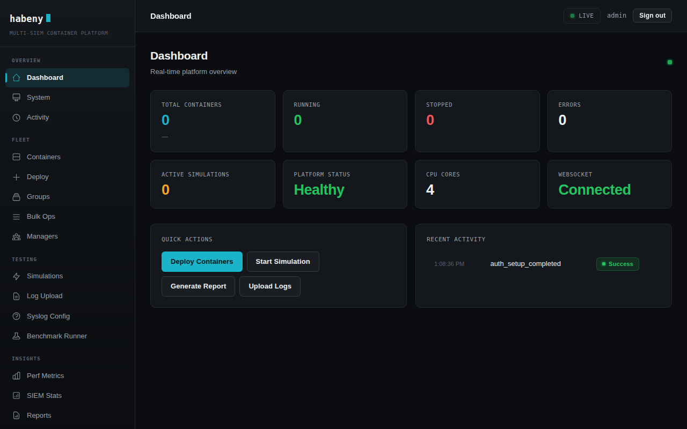

# Habeny — Multi-SIEM Container Emulation Platform

LXC-based platform for deploying containers that run SIEM agents at scale.
Deploy hundreds of lightweight containers, each running a real SIEM agent,
to stress-test and validate your SIEM infrastructure.



## Supported SIEM Types

| Type | Agent | Registration |
|------|-------|-------------|
| **Wazuh** | wazuh-agent | Auto-registers with manager |
| **OSSEC** | ossec-hids-agent | Atomicorp installer + agent-auth |
| **OSSIM** | AlienVault agent | Config-based |
| **UTMstack** | utmstack_agent_service | Auth key enrollment |
| **Elastic** | elastic-agent | Fleet enrollment token |
| **None** | — | Bare container (no agent) |

## Prerequisites

- **Ubuntu 22.04+** host
- **Root access** (LXC requires root)
- **LXC** and its Python bindings: `sudo apt install lxc lxc-utils python3-lxc`
- **Python 3.10+** with pip
- **Node.js 20.19+ or 22.12+** (to build and run the frontend; 22 LTS recommended)

## Production install

Habeny runs as two services so the web app never runs as root:

- **habeny** — the web app, as the unprivileged `habeny` user, sandboxed by systemd
  (read-only system, no capabilities; it can only write its data directory).
- **habeny-helper** — a small root service that performs container operations for it
  over a Unix socket (`/run/habeny/helper.sock`, only `habeny`/root may connect). It
  accepts a fixed list of LXC operations and validates every argument: e.g. it will
  set only the network keys the app uses, never hooks or mounts, and create only the
  offered OS images.

```bash
git clone <repo> ~/Habeny && cd ~/Habeny     # the checkout can live anywhere
sudo ./deploy/install.sh    # installs a copy to /opt/habeny: packages, user, venv, frontend, units
systemctl status habeny habeny-helper
```

The installer copies the app to `/opt/habeny` (`HABENY_INSTALL_DIR` to change; it must be
outside `/home`) and leaves your checkout untouched. To upgrade: `git pull` in the checkout,
then run `sudo ./deploy/install.sh` again.

Optional settings (TLS certificate, reverse-proxy mode, port) go in `/etc/default/habeny`.
Upgrading from a root install: `install.sh` hands the existing data directory to `habeny`.

Note: containers are still privileged LXC containers, so root inside a container is
powerful; the helper keeps web-app bugs from being root on the host, but the console
and agent installs run as root *inside* containers by design.

## Quick Start

```bash
# Install Python dependencies
pip install -r requirements.txt

# Development: build the frontend (if needed) and run everything as root
sudo ./start.sh
```

Open `https://<host>:9000` — the API and the web UI are both served from there (see [HTTPS](#https)).
`start.sh` installs the frontend's npm dependencies on first run and rebuilds
`static/` whenever the sources in `frontend/` have changed.

## HTTPS

The server speaks **HTTPS only** on port 9000. On first start it generates a
self-signed certificate (`/var/lib/lxc-siem-platform/tls/`), so browsers show a
warning once; traffic is encrypted either way.

| Setting | Purpose |
|---|---|
| `HABENY_TLS_CERT`, `HABENY_TLS_KEY` | Use your own certificate (PEM paths). Also enables HSTS. |
| `HABENY_TLS=off` | Plain HTTP, **only** behind a reverse proxy that terminates TLS |
| `HABENY_HOST`, `HABENY_PORT` | Listen address (default `0.0.0.0:9000`) |
| `HABENY_CORS_ORIGINS` | Comma-separated origins allowed to call the API from another site (default: none, same-origin only) |

Behind a reverse proxy, bind to localhost and let the proxy handle TLS. The proxy
must send `X-Forwarded-Proto` so session cookies are marked `Secure` (trusted from
`127.0.0.1` by default; set `FORWARDED_ALLOW_IPS` if the proxy is elsewhere):

```nginx
server {
    listen 443 ssl;
    server_name habeny.example.com;
    ssl_certificate     /etc/ssl/habeny.crt;
    ssl_certificate_key /etc/ssl/habeny.key;
    add_header Strict-Transport-Security "max-age=31536000" always;

    location / {
        proxy_pass http://127.0.0.1:9000;
        proxy_set_header Host $host;
        proxy_set_header X-Forwarded-Proto https;
        proxy_http_version 1.1;                       # WebSockets (live metrics, console)
        proxy_set_header Upgrade $http_upgrade;
        proxy_set_header Connection "upgrade";
    }
}
```
```bash
sudo HABENY_TLS=off HABENY_HOST=127.0.0.1 ./start.sh
```

The dev server (`./start.sh --dev`, port 3000) is plain HTTP for development only.

## Authentication

The web UI and the API require signing in. On first start there are no accounts:
open the UI and it asks you to **create the admin account** (with the setup token, see below). After that, the
sign-in page is shown to anyone without a valid session.

- **Account** (sidebar → Settings, or click your username): change your password.
  This signs you out on your other devices.
- **Users** (on the same page, administrators only): add users, change their role,
  reset a user's password (signs them out everywhere) and delete users. You can't delete
  or demote yourself, and there is always at least one administrator.
- **Roles**, enforced by the server on every request:

  | Role | Can |
  |---|---|
  | Viewer | See everything (dashboards, containers, reports, activity); change nothing |
  | Operator | Viewer + deploy/start/stop/delete containers, simulations, log uploads, console, profiles |
  | Admin | Operator + manage users |

  New users are viewers unless you choose otherwise. On upgrade, existing non-admin
  accounts become operators (the access they already had).
- New passwords need 12+ characters (`HABENY_PASSWORD_MIN_LENGTH`), can't be a common
  password or contain the username.
- Sessions are HttpOnly cookies, valid for 7 days (`HABENY_SESSION_TTL_HOURS` to change).
  **Account → Active sessions** lists your sign-ins (device, IP, last seen) and can end
  any of them; admins can sign a user out everywhere from the Users table.
- **Two-factor authentication** (Account → Two-factor): scan a QR code with any
  authenticator app (Google/Microsoft Authenticator, 1Password, Authy…), then sign-in asks
  for the 6-digit code. You get 10 one-time recovery codes for a lost phone; an admin can
  reset 2FA for a user who lost both (Users → Reset 2FA).
- After 10 failed sign-ins from one IP within 15 minutes, further attempts are refused for a while.
- Sign-ins, failed sign-ins, setup and every user-management action are recorded in the Activity log.
- First-run setup needs a one-time **setup token**, so nobody else who can reach the
  server can claim the admin account. It is printed to the log and saved to a file only
  root and the service can read:
  `sudo cat /var/lib/lxc-siem-platform/setup-token` or `journalctl -u habeny | grep "setup token"`.

### Single sign-on (OpenID Connect)

Users can sign in through your identity provider: Microsoft Entra ID, Okta, Google
Workspace, Keycloak, Authentik or anything else that speaks OIDC. Register Habeny as a
web application ("confidential client") with this redirect URI:

    https://<your-habeny-host>:9000/api/auth/oidc/callback

then add to `/etc/default/habeny` (keep it `chmod 600`: it holds the client secret) and
`sudo systemctl restart habeny`:

| Variable | Meaning |
|---|---|
| `HABENY_OIDC_ISSUER` | Issuer URL, e.g. `https://login.microsoftonline.com/<tenant-id>/v2.0` (turns SSO on) |
| `HABENY_OIDC_CLIENT_ID` / `HABENY_OIDC_CLIENT_SECRET` | From the app registration |
| `HABENY_OIDC_REDIRECT_URI` | The redirect URI above. Set it when behind a reverse proxy |
| `HABENY_OIDC_ADMIN_GROUPS`, `..._OPERATOR_GROUPS`, `..._VIEWER_GROUPS` | Comma-separated group names/IDs from the `groups` claim. When any is set, the role follows group membership on every sign-in and people in none of them are refused |
| `HABENY_OIDC_DEFAULT_ROLE` | Without group mapping: role for new SSO users (default `viewer`; admins can change it) |
| `HABENY_OIDC_USERNAME_CLAIM` | Claim used as the username (default `preferred_username`, then `email`) |
| `HABENY_OIDC_GROUPS_CLAIM`, `HABENY_OIDC_SCOPES`, `HABENY_OIDC_BUTTON_LABEL`, `HABENY_OIDC_CA_BUNDLE` | Optional: groups claim name (default `groups`), scopes (default `openid profile email`; add `groups` for Keycloak/Authentik), sign-in button text, CA file for a private IdP |

The sign-in page then shows a "Sign in with SSO" button. The first SSO sign-in creates the
account; SSO accounts have no Habeny password, and their two-factor is whatever the identity
provider enforces. An SSO identity never takes over an existing local account with the same
name: that sign-in is refused. Local accounts keep working, so keep one local admin as a
break-glass account. SAML and LDAP aren't supported; most identity providers that offer
them offer OIDC too.

**Stored secrets:** SIEM auth keys and enrollment tokens in manager profiles are encrypted
in the database and never sent back to the browser (only the last 4 characters are shown).
The encryption key is generated on first start at `/var/lib/lxc-siem-platform/secret.key`
(or set `HABENY_SECRET_KEY`). **Back it up together with `platform.db`**: without it, stored
keys can't be read and must be re-entered in each profile.

**Forgotten password:** another administrator can reset it on the Account page. If the only
administrator is locked out, remove all accounts on the server and the UI will offer setup again:

```bash
sudo python3 -c "import sqlite3; c = sqlite3.connect('/var/lib/lxc-siem-platform/platform.db'); c.execute('DELETE FROM sessions'); c.execute('DELETE FROM users'); c.commit()"
```

## Frontend

For development with hot reload, run the API and the Vite dev server together:

```bash
sudo ./start.sh --dev   # UI on http://<host>:3000 (dev only), proxies to the API on :9000
```

To build the frontend manually:

```bash
cd frontend
npm install
npm run build      # outputs to ../static/
```

## Project Structure

```
.
├── main.py                  # Entry point: logging setup + create_app()
├── deploy/                  # install.sh + systemd units (web app + root helper)
├── start.sh                 # Quick start: builds frontend, runs API
├── app/                     # FastAPI application
│   ├── __init__.py          # create_app(): storage init, middleware, routers
│   ├── config.py            # Paths and tunables
│   ├── state.py             # In-memory state shared by routes/services
│   ├── middleware.py        # /api prefix stripping, latency tracking
│   ├── db.py                # SQLite database layer
│   ├── helper/              # Privileged LXC helper (root) + client used by the web app
│   ├── routes/              # One APIRouter per domain (agents, groups, ...)
│   ├── services/            # Deployment, simulations, reporting, logs, benchmarks, ...
│   ├── core/                # Shell/lxc-attach, container, network, resources, helpers
│   ├── installers/          # One module per SIEM agent + batch dispatcher, package cache
│   ├── simulation/          # Attack simulation engine
│   └── models/              # Pydantic models by domain (import from app.models)
├── requirements.txt         # Python dependencies
├── ruff.toml                # Python linter config (ruff)
├── index.legacy.html        # Legacy single-file frontend
│
├── frontend/                # React + Vite frontend
│   ├── src/
│   │   ├── App.jsx          # Router, layout, sidebar
│   │   ├── api.js           # API client
│   │   ├── ws.js            # WebSocket hook for live metrics
│   │   ├── store.jsx        # Global state context
│   │   ├── pages/           # Page components
│   │   └── components/      # Reusable UI components
│   └── .eslintrc.cjs        # JavaScript linter config
│
├── tests/                   # Test suite
│   ├── test_db.py           # Database layer tests
│   ├── test_models.py       # Model validation tests
│   └── test_core_shell.py   # Shell command tests
```

## API Endpoints

### System
- `GET /` — API info
- `GET /system/info` — Platform and LXC details
- `GET /system/health` — Health check

### Containers
- `POST /agents/deploy` — Deploy containers with SIEM agents
- `GET /agents` — List containers (filterable, paginated)
- `GET /agents/{id}` — Container detail
- `POST /agents/{id}/start` — Start a container
- `POST /agents/{id}/stop` — Stop a container
- `DELETE /agents/{id}` — Delete a container
- `POST /agents/bulk/{operation}` — Bulk start/stop/delete

### Manager Profiles
- `GET /managers` — List saved profiles
- `POST /managers` — Create a profile
- `GET /managers/{id}` — Get a profile
- `PUT /managers/{id}` — Update a profile
- `DELETE /managers/{id}` — Delete a profile

### Groups
- `GET /groups` — List groups
- `POST /groups` — Create a group
- `POST /groups/{name}/assign` — Assign containers
- `POST /groups/{name}/remove` — Remove containers
- `DELETE /groups/{name}` — Delete a group

### Simulations
- `POST /simulations/start` — Attack simulation
- `POST /simulations/load` — Custom EPS log simulation
- `POST /simulations/syslog/start` — Syslog simulation
- `GET /simulations` — List simulations
- `POST /simulations/{id}/stop` — Stop a simulation

### Reports & Logs
- `POST /reports/generate` — Generate report (JSON/CSV/PDF)
- `GET /reports/{id}/download` — Download report
- `POST /agents/{id}/logs/upload` — Upload logs to container
- `GET /activity/logs` — Activity audit log

### WebSocket
- `WS /ws/metrics` — Live platform metrics (5s interval)
- `WS /ws/console/{name}` — Interactive container terminal

## Linting

```bash
# Python (ruff)
pip install -r requirements-dev.txt
ruff check .
ruff format .

# JavaScript (eslint)
cd frontend && npx eslint src/
```

## Testing

```bash
pip install -r requirements-dev.txt
python3 -m pytest tests/ -v

# Without LXC (e.g. on a laptop): use the in-memory python-lxc stand-in
HABENY_LXC_BACKEND=direct PYTHONPATH=tests/stubs python3 -m pytest tests/
```

CI (`.github/workflows/ci.yml`) runs the tests on Python 3.10 and 3.12, the ruff
correctness rules, a frontend build, and `pip-audit` / `npm audit` on every push and pull
request and weekly. Dependabot (`.github/dependabot.yml`) proposes dependency updates.

## Security

To report a vulnerability, see [SECURITY.md](SECURITY.md). It also summarizes how Habeny is
secured. The brief for an independent security review is in
[docs/security-review-scope.md](docs/security-review-scope.md).

## License

Proprietary — Habeny Platform.
